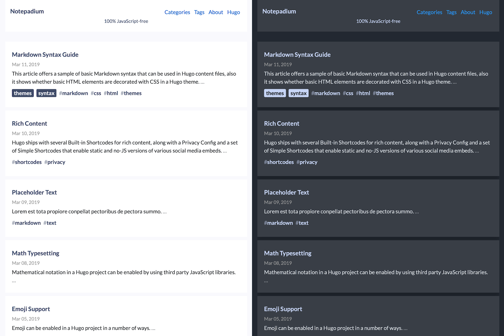

# hugo-notepadium  [](https://lvv.me)

a fast [gohugo](https://gohugo.io) theme, **100% JavaScript-free**.

- builtin syntanx highlighting
- builtin all chroma/hljs/prismjs themes
- support comments by Disqus
- support math by MathJax

The core CSS is `core.css`, transferred size < 3KB.

Preview exampleSite:

```shell
git clone https://github.com/cntrump/hugo-notepadium.git hugo-notepadium
cd hugo-notepadium/exampleSite
hugo server --themesDir ../..
```

## Quick Start

```shell
git submodule add https://github.com/cntrump/hugo-notepadium.git themes/hugo-notepadium
```

Demo `config.toml`:

```toml
baseURL = "/"
languageCode = "zh-cn"
theme = "hugo-notepadium"

hasCJKLanguage = true
enableRobotsTXT = true

title = "Lvv's notepad"
copyright = "Copyright ©2019 lvv. All rights reserved."

[markup.highlight]
codeFences = true
noClasses = false

```

If you like syntax highlight with JS, both `hljs` and `prismjs` are builtin:

```toml
# enable JS highlight
[params.syntax]
use = "hljs"  # 1. prismjs 2. hljs 3. none
theme = "dracula"  # load css/chroma/* themes when use="none"
enableBuiltinFont = true  # use builtin font: source-code-pro
```

Enable `MathJax` support

```toml
[params.MathJax]
enable = true
url = ""  # builtin CDN: "https://cdnjs.cloudflare.com/ajax/libs/mathjax/2.7.6/MathJax.js?config=TeX-AMS-MML_HTMLorMML"
```

Usage

```
When $a \ne 0$, there are two solutions to \(ax^2 + bx + c = 0\) and they are
$$x = {-b \pm \sqrt{b^2-4ac} \over 2a}.$$
```

You can custom nav items:

```toml
[params.nav]
showCategories = true       # /categories/
showTags = true             # /tags/

# custom links

[[params.nav.custom]]
title = "iOS"
url = "/tags/ios"

[[params.nav.custom]]
title = "Repo"
url = "//github.com/cntrump"

```

Set site slogan and logo

```toml
[params]
logo = "logo.png"
slogan = "code my life ~"
```

Enable comments

Setup Disqus [shortname](https://help.disqus.com/en/articles/1717111-what-s-a-shortname) in config.toml:

```toml
# disqus
disqusShortname = "XXX"  # your short name
```

By default, comments is disabled for all posts.

You can enable comments like below:

```md
+++
title = "..."
date = 2019-12-08
...
comments = true
+++

...
```
